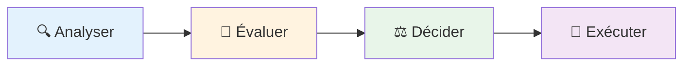

# Roadmap des démonstrations

## Le pattern à observer

**L'IA propose → L'humain valide → L'IA exécute**

### Pourquoi ce pattern ?

- Tire parti de la vitesse de l'IA sans sacrifier le contrôle
- Réduit la charge cognitive : l'IA explore, vous décidez
- Scalable : adaptable du code individuel aux systèmes complexes

<!--
**Timing**: 1 minute

**Objectif**: Prévisualiser la progression et établir les attentes pour le pattern.

**Talking points**:
- "On va passer par 4 étapes de complexité croissante"
- "Commencer par l'analyse - faible risque, haute valeur"
- "Finir par l'automation - plus puissant mais nécessite plus de validation"
- "À CHAQUE étape, remarquez le pattern: l'IA fait des suggestions, VOUS les validez"
- "Cette progression reflète comment intégrer l'IA progressivement"
- "Commencez par des outils read-only, montez vers des modifications"

**Transition vers slide 10**:
"Commençons par la première étape: l'analyse de code..."

**Énergie**: Anticipation - construire l'intérêt pour les démos
-->
