# Demo roadmap

```mermaid
graph LR
    A[🔍 Analyze] --> B[🧠 Evaluate]
    B --> C[⚖️ Decide]
    C --> D[🤖 Execute]

    style A fill:#e3f2fd
    style B fill:#fff3e0
    style C fill:#e8f5e9
    style D fill:#f3e5f5
```

## The pattern to observe

**AI proposes → Human validates → AI executes**

### Why this pattern?

- Leverages AI speed without sacrificing control
- Reduces cognitive load: AI explores, you decide
- Scalable: adaptable from individual code to complex systems

<!--
**Timing**: 1 minute

**Objective**: Preview the progression and set expectations for the pattern.

**Talking points**:
- "We'll go through 4 stages of increasing complexity"
- "Start with analysis - low risk, high value"
- "End with automation - more powerful but requires more validation"
- "At EACH stage, notice the pattern: AI makes suggestions, YOU validate them"
- "This progression reflects how to integrate AI progressively"
- "Start with read-only tools, work up to modifications"

**Transition to slide 10**:
"Let's start with the first step: code analysis..."

**Energy**: Anticipation - build interest for the demos
-->
