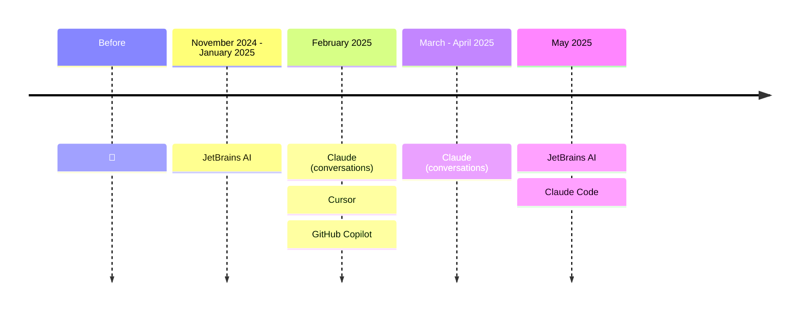

# My journey with AI in development

<!--
- Before, I was more of an observer. I could see things were happening but wasn't convinced it could really help me, so I didn't test it.
- November 2024: JetBrains releases its AI plugin and agent (Junie). The agent is very slow and I'm still faster doing things myself. The AI plugin is intellisense on steroids - I can't do without it anymore (even though it's still enhanced autocomplete)
- February: my client pushes AI adoption, I can test Cursor and GitHub Copilot. I see the value but don't stick with them - I miss my JetBrains IDE. I subscribe to Claude to use it in conversation mode, copy-pasting snippets and starting to have good discussions with it.
- May 2025: I get access to Claude Code through my client, I test it and stick with it. You need to learn how to use it but I feel more efficient. At first I use it occasionally but since July I use it daily. It doesn't do everything - often it starts and I finish. I'm still learning. Tools, models, and usage patterns evolve very quickly and you need to keep up.
-->
