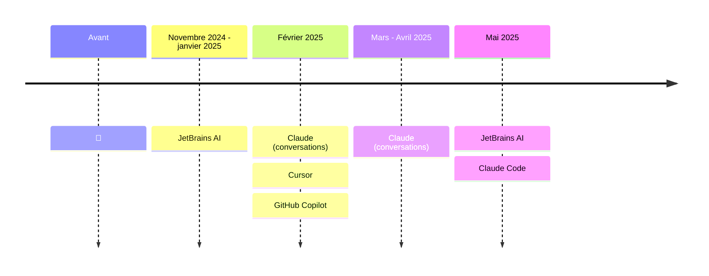

# Mon parcours avec l'IA dans le développement

<!--
- Avant j'étais plus en mode observateur, je voyais qu'il se passait des choses mais je n'étais pas convaincu que ca pouvait vraiment m'aider et je ne testais pas.
- Novembre 2024 : JetBrains, sort son plugin IA et son agent (Junie). L'agent est très lent et je ne vais encore plus vite à faire les choses moi même. Le plugin AI c'est l'intellisense on-steroid, je ne peux plus faire sans (même si ca reste de l'auto-complète amélioré)
- Février : mon client pousse l'utilisation de l'IA, je peux tester Cursor et GitHub Copilot. Je vois la plus-value mais n'accroche pas, mon IDE JetBrains me manque. Je prends mon abonnement à Claude pour l'utiliser en mode conversation, je copie-colle des snippets et commence à avoir de bonnes discussions avec.
- Mai 2025 : j'ai accès à Claude Code par mon client, je teste et je m'y tiens, il faut apprendre à s'en servir mais je me sens plus efficace. Au début je l'utilise ponctuellement mais depuis juillet je l'utilise de manière quotidienne. Il ne fait pas tout, souvent il commence et je termine. J'apprends encore, les outils, modèles et usages évoluent très vite et il faut suivre.
-->
